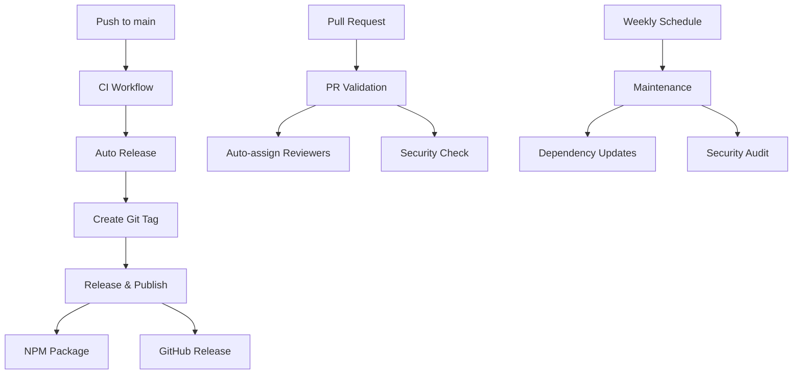

# CI/CD Pipeline Documentation

This directory contains the complete CI/CD pipeline configuration for the MCP Task Manager project.

> **Note**: This file was renamed from `README.md` to `CICD.md` to prevent GitHub from displaying it instead of the main project README.md on the repository homepage.

## 🚀 Pipeline Overview

Our CI/CD pipeline provides comprehensive automation for:
- **Continuous Integration**: Build validation, testing, and quality checks
- **Automated Releases**: Version management and GitHub releases
- **NPM Publishing**: Automatic package publishing to npm registry
- **Maintenance**: Dependency updates, security audits, and cleanup

## 📁 Workflow Files

### Core Workflows

| Workflow | File | Trigger | Purpose |
|----------|------|---------|---------|
| **Continuous Integration** | `ci.yml` | Push/PR to main/develop | Build validation, security audit, performance checks |
| **Pull Request Validation** | `pr-validation.yml` | Pull request events | PR validation, auto-labeling, reviewer assignment |
| **Auto Release** | `auto-release.yml` | Push to main, manual | Automatic version bumping and release triggering |
| **Release & Publish** | `publish.yml` | Git tags, manual | GitHub releases and npm publishing |
| **Maintenance** | `maintenance.yml` | Weekly schedule, manual | Dependency updates, security audits |

### Workflow Dependencies



## 🔧 Setup Instructions

### 1. Required Secrets

Configure these secrets in your GitHub repository:

```bash
# Repository Settings → Secrets and variables → Actions
NPM_TOKEN=npm_xxxxxxxxxxxxxxxxxxxxxxxxxxxxxxxx
```

### 2. Quick Setup Script

```bash
# Run the setup script to configure npm token
./.github/scripts/setup-npm.sh
```

### 3. Repository Permissions

Ensure these permissions are enabled:
- Actions: Read and write
- Contents: Read and write
- Issues: Read and write
- Pull requests: Read and write

## 🔄 Workflow Details

### Continuous Integration (`ci.yml`)

**Triggers:**
- Push to `main` or `develop` branches
- Pull requests to `main` or `develop`

**Jobs:**
- **Build & Validate**: Multi-Node.js version testing (18, 20)
- **Security Audit**: npm audit and vulnerability scanning
- **Performance Check**: Package size, startup time, memory usage
- **Documentation Check**: Validates required documentation files

**Matrix Strategy:**
```yaml
strategy:
  matrix:
    node-version: [18, 20]
```

### Pull Request Validation (`pr-validation.yml`)

**Features:**
- Automatic PR size analysis
- Breaking change detection
- Auto-labeling based on changed files
- Security validation
- MCP protocol compliance checks

**Auto-assigned Labels:**
- `core` - Changes to core business logic
- `handlers` - Changes to MCP handlers
- `documentation` - Documentation updates
- `dependencies` - Package.json changes

### Auto Release (`auto-release.yml`)

**Smart Release Detection:**
- Detects source code changes in `src/`
- Automatic patch version bumping
- Manual version control support
- Changelog generation

**Release Types:**
- `patch` - Bug fixes and minor updates
- `minor` - New features (backward compatible)
- `major` - Breaking changes

### Release & Publish (`publish.yml`)

**Comprehensive Release Process:**
1. Build validation and artifact creation
2. Changelog generation from git history
3. GitHub release creation with assets
4. npm package publishing
5. Publication verification

**Release Assets:**
- Source code (tar.gz, zip)
- Built distribution package
- Comprehensive changelog

### Maintenance (`maintenance.yml`)

**Automated Maintenance Tasks:**
- **Weekly dependency updates** with PR creation
- **Security vulnerability scanning** with issue creation
- **Performance benchmarking** and monitoring
- **Repository cleanup** (old branches, large files)

## 📊 Monitoring & Observability

### Workflow Status Monitoring

```bash
# Check workflow status
gh run list --workflow=ci.yml --limit=10

# View specific run details
gh run view <run-id>

# Download workflow logs
gh run download <run-id>
```

### Release Monitoring

```bash
# List recent releases
gh release list --limit=10

# View release details
gh release view v1.0.0

# Check npm package status
npm view task-list-mcp
```

### Performance Metrics

The CI pipeline tracks:
- **Build time**: TypeScript compilation duration
- **Package size**: npm package size optimization
- **Startup time**: CLI initialization performance
- **Memory usage**: Runtime memory consumption

## 🚨 Troubleshooting

### Common Issues

#### NPM Publishing Fails
```
Error: 403 Forbidden - PUT https://registry.npmjs.org/task-list-mcp
```
**Solutions:**
1. Verify NPM_TOKEN is configured correctly
2. Check npm token has publish permissions
3. Ensure package name is available
4. Verify npm account has 2FA configured properly

#### GitHub Release Creation Fails
```
Error: Resource not accessible by integration
```
**Solutions:**
1. Check repository permissions for Actions
2. Verify GITHUB_TOKEN has sufficient permissions
3. Ensure branch protection rules allow Actions

#### Build Fails on Node Version Matrix
```
Error: Cannot find module '@types/node'
```
**Solutions:**
1. Ensure all Node.js versions are supported
2. Check package.json engines field
3. Verify TypeScript compatibility

### Debug Commands

```bash
# Test build locally
npm run build

# Validate package contents
npm pack --dry-run

# Test CLI functionality
node dist/cli.js --version

# Check npm authentication
npm whoami

# Validate package.json
npm pkg fix
```

## 🔄 Release Process

### Automatic Release (Recommended)

1. **Make changes** to source code
2. **Push to main** branch
3. **CI validates** changes automatically
4. **Auto-release** detects changes and bumps version
5. **Release workflow** creates GitHub release and publishes to npm

### Manual Release

1. **Update version** in package.json
2. **Commit and push** to main
3. **System detects** version change
4. **Release workflow** triggers automatically

### Emergency Release

1. **Go to Actions** → "Release and Publish"
2. **Click "Run workflow"**
3. **Enter version** (e.g., 1.0.1)
4. **Click "Run workflow"**

## 📈 Best Practices

### Development Workflow

1. **Feature branches**: Always use feature branches for development
2. **Pull requests**: All changes go through PR review
3. **Semantic versioning**: Follow semver for version bumping
4. **Commit messages**: Use conventional commit format

### Release Management

1. **Test thoroughly**: Ensure all CI checks pass
2. **Review changelogs**: Verify auto-generated changelogs
3. **Monitor releases**: Check npm and GitHub releases
4. **Rollback plan**: Know how to rollback if needed

### Security

1. **Regular audits**: Weekly security scans
2. **Dependency updates**: Automated dependency management
3. **Secret rotation**: Regularly rotate npm tokens
4. **Vulnerability response**: Address security issues promptly

## 📚 Additional Resources

- [GitHub Actions Documentation](https://docs.github.com/en/actions)
- [npm Publishing Guide](https://docs.npmjs.com/packages-and-modules/contributing-packages-to-the-registry)
- [Semantic Versioning](https://semver.org/)
- [Conventional Commits](https://www.conventionalcommits.org/)

## 🆘 Support

For CI/CD pipeline issues:

1. **Check workflow logs** in the Actions tab
2. **Review this documentation** for common solutions
3. **Verify secrets configuration** using setup guide
4. **Create an issue** if problems persist

---

*This CI/CD pipeline is designed to provide robust, automated release management while maintaining high quality standards and security practices.*