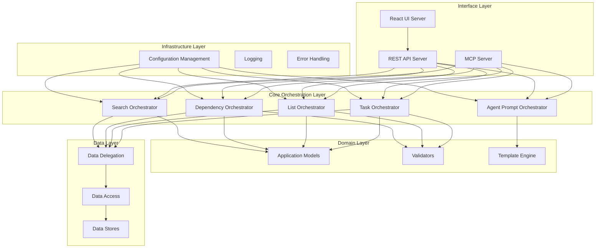

# Design Document

## Overview

The Task MCP Unified system will undergo a comprehensive architectural transformation to become a production-ready, enterprise-grade task management platform. The design implements a domain-driven architecture with strict separation of concerns, comprehensive orchestration layers, and multiple interface options (MCP, REST API, and React UI).

The system will maintain backward compatibility while introducing modern architectural patterns, enhanced error handling, comprehensive testing, and operational excellence. The design emphasizes simplicity, maintainability, and extensibility while removing unnecessary complexity.

## Architecture

### High-Level Architecture



### Domain-Driven Organization

The system will be organized into clear domains following DDD principles:

```
src/
├── core/
│   └── orchestration/
│       ├── interfaces/
│       ├── services/
│       └── validators/
├── domain/
│   ├── models/
│   └── tasks/
├── data/
│   ├── delegation/
│   ├── access/
│   └── stores/
├── api/
│   ├── mcp/
│   │   ├── tools/
│   │   └── handlers/
│   └── rest/
│       ├── routes/
│       └── controllers/
├── ui/
│   ├── components/
│   ├── pages/
│   └── services/
├── infrastructure/
│   ├── config/
│   ├── logging/
│   └── storage/
└── shared/
    ├── types/
    ├── utils/
    └── errors/
```

## Components and Interfaces

### Core Orchestration Layer

#### Base Orchestrator Interface

```typescript
interface BaseOrchestrator {
  validate(data: unknown): ValidationResult;
  handleError(error: Error, context: string): OrchestrationError;
  delegateData(operation: DataOperation): Promise<unknown>;
}
```

#### Task Orchestrator

- **Purpose**: Centralized task management with business rule enforcement
- **Responsibilities**:
  - Task CRUD operations with validation
  - Status transition management
  - Priority and tag management
  - Agent prompt template handling
- **Key Methods**:
  - `createTask(data: CreateTaskData): Promise<Task>`
  - `updateTask(id: string, data: UpdateTaskData): Promise<Task>`
  - `setTaskStatus(id: string, status: TaskStatus): Promise<Task>`
  - `addTaskTags(id: string, tags: string[]): Promise<Task>`
  - `removeTaskTags(id: string, tags: string[]): Promise<Task>`

#### Dependency Orchestrator

- **Purpose**: Manages task dependencies with circular dependency prevention
- **Responsibilities**:
  - Dependency validation and setting
  - Circular dependency detection (O(n) algorithm)
  - Block reason calculation
  - Ready task identification
- **Key Methods**:
  - `setTaskDependencies(taskId: string, dependencies: string[]): Promise<void>`
  - `detectCircularDependencies(graph: DependencyGraph): CircularDependencyResult`
  - `calculateBlockReason(taskId: string): BlockReason`
  - `getReadyTasks(listId: string): Promise<Task[]>`

#### List Orchestrator

- **Purpose**: Manages task lists with comprehensive validation
- **Responsibilities**:
  - List CRUD operations
  - List metadata management
  - List validation and constraints
- **Key Methods**:
  - `createList(data: CreateListData): Promise<TaskList>`
  - `updateList(id: string, data: UpdateListData): Promise<TaskList>`
  - `deleteList(id: string): Promise<void>`
  - `getAllLists(filters?: ListFilters): Promise<TaskList[]>`

#### Search Orchestrator

- **Purpose**: Unified search across tasks and lists
- **Responsibilities**:
  - Multi-criteria search and filtering
  - Pagination support
  - Agent prompt template filtering
- **Key Methods**:
  - `searchTasks(criteria: SearchCriteria): Promise<SearchResult<Task>>`
  - `searchLists(criteria: SearchCriteria): Promise<SearchResult<TaskList>>`
  - `unifiedSearch(criteria: UnifiedSearchCriteria): Promise<UnifiedSearchResult>`

#### Agent Prompt Orchestrator

- **Purpose**: Manages agent prompt templates and rendering
- **Responsibilities**:
  - Template validation and storage
  - Variable resolution and rendering
  - Performance optimization (< 10ms simple, < 50ms complex)
- **Key Methods**:
  - `getAgentPrompt(taskId: string, useDefault?: boolean): Promise<string>`
  - `validateTemplate(template: string): ValidationResult`
  - `renderTemplate(template: string, context: TemplateContext): Promise<string>`

### Domain Models

#### Task Model (formerly TodoItem)

```typescript
interface Task {
  id: string;
  title: string;
  description?: string;
  status: TaskStatus;
  priority: Priority;
  createdAt: Date;
  updatedAt: Date;
  completedAt?: Date;
  dependencies: string[];
  estimatedDuration?: number;
  tags: string[];
  metadata: Record<string, unknown>;

  // Enhanced fields
  agentPromptTemplate?: string; // Max 10,000 chars
  actionPlan?: ActionPlan;
  implementationNotes: ImplementationNote[];
  exitCriteria: ExitCriteria[];
}
```

#### TaskList Model (formerly TodoList)

```typescript
interface TaskList {
  id: string;
  title: string;
  description?: string;
  items: Task[];
  createdAt: Date;
  updatedAt: Date;
  completedAt?: Date;
  projectTag: string;
  totalItems: number;
  completedItems: number;
  progress: number;
  metadata: Record<string, unknown>;
  implementationNotes: ImplementationNote[];
}
```

#### Template System Models

```typescript
interface TemplateVariable {
  name: string;
  namespace: "task" | "list";
  value: unknown;
}

interface TemplateContext {
  task: Task;
  list: TaskList;
  variables: TemplateVariable[];
}

interface TemplateResult {
  rendered: string;
  renderTime: number;
  variablesUsed: string[];
  errors?: string[];
}
```

### Data Layer Architecture

#### Data Delegation Layer

- **Purpose**: Enforces orchestration-only data access
- **Pattern**: All data operations must go through orchestrators
- **Implementation**: Proxy pattern with access control

#### Data Access Layer

- **Purpose**: Abstraction over different storage backends
- **Current Implementation**: File system storage
- **Future Support**: Database, cloud storage, etc.

#### Data Stores

- **File Storage**: JSON-based file storage with atomic operations
- **Memory Storage**: In-memory storage for testing
- **Configuration**: Pluggable storage backends via configuration

### Interface Layers

#### MCP Server Interface

- **Organization**: Domain-based tool organization
- **Tools**: Consolidated tool definitions with handlers
- **Validation**: Comprehensive parameter validation with descriptive errors
- **Removed Features**: Intelligence tools, bulk operations, multiple formats

#### REST API Interface

- **Architecture**: Direct interaction with orchestration layer
- **Features**: Full CRUD operations on all entities
- **Bulk Operations**: Supported (unlike MCP)
- **Documentation**: OpenAPI/Swagger documentation

#### React UI Interface

- **Framework**: React with Storybook design system
- **Design**: Elegant UI components with micro-animations
- **Integration**: Consumes REST API exclusively
- **Features**: Complete task management functionality

## Data Models

### Enhanced Task Status Management

```typescript
enum TaskStatus {
  PENDING = "pending",
  IN_PROGRESS = "in_progress",
  COMPLETED = "completed",
  BLOCKED = "blocked",
  CANCELLED = "cancelled",
}

// Status transition rules
const VALID_TRANSITIONS: Record<TaskStatus, TaskStatus[]> = {
  [TaskStatus.PENDING]: [TaskStatus.IN_PROGRESS, TaskStatus.CANCELLED],
  [TaskStatus.IN_PROGRESS]: [
    TaskStatus.COMPLETED,
    TaskStatus.BLOCKED,
    TaskStatus.CANCELLED,
  ],
  [TaskStatus.BLOCKED]: [TaskStatus.IN_PROGRESS, TaskStatus.CANCELLED],
  [TaskStatus.COMPLETED]: [], // Terminal state
  [TaskStatus.CANCELLED]: [TaskStatus.PENDING], // Can be reactivated
};
```

### Enhanced Tag System

```typescript
interface TagValidation {
  pattern: RegExp; // Supports emoji, unicode, uppercase, numbers, hyphens, underscores
  maxLength: number;
  examples: string[];
}

const TAG_VALIDATION: TagValidation = {
  pattern: /^[\p{L}\p{N}\p{Emoji}_-]+$/u, // Unicode letters, numbers, emoji, underscore, hyphen
  maxLength: 50,
  examples: [
    "🚀urgent",
    "HIGH-PRIORITY",
    "français",
    "bug-fix",
    "review_needed",
  ],
};
```

### Dependency Graph Model

```typescript
interface DependencyGraph {
  nodes: Map<string, DependencyNode>;
  edges: Map<string, string[]>;
}

interface DependencyNode {
  id: string;
  title: string;
  status: TaskStatus;
  dependencies: string[];
  dependents: string[];
  depth: number;
  isBlocked: boolean;
  blockReason?: BlockReason;
}

interface BlockReason {
  blockedBy: string[];
  details: Array<{
    taskId: string;
    taskTitle: string;
    status: TaskStatus;
    estimatedCompletion?: Date;
  }>;
}
```

## Error Handling

### Orchestration Error System

```typescript
class OrchestrationError extends Error {
  constructor(
    message: string,
    public context: string,
    public currentValue?: unknown,
    public expectedValue?: unknown,
    public actionableGuidance?: string
  ) {
    super(message);
  }
}

// Specific error types
class ValidationError extends OrchestrationError {}
class CircularDependencyError extends OrchestrationError {}
class StatusTransitionError extends OrchestrationError {}
class TemplateRenderError extends OrchestrationError {}
```

### Error Response Format

```typescript
interface ErrorResponse {
  error: {
    type: string;
    message: string;
    context: string;
    currentValue?: unknown;
    expectedValue?: unknown;
    actionableGuidance?: string;
    timestamp: string;
    requestId: string;
  };
}
```

## Testing Strategy

### Testing Organization

```
tests/
├── unit/
│   ├── core/
│   │   └── orchestration/
│   ├── domain/
│   │   ├── models/
│   │   └── tasks/
│   ├── data/
│   │   ├── delegation/
│   │   ├── access/
│   │   └── stores/
│   └── api/
│       ├── mcp/
│       └── rest/
├── integration/
│   ├── orchestration/
│   ├── api/
│   └── end-to-end/
└── performance/
    ├── template-rendering/
    ├── dependency-detection/
    └── search-operations/
```

### Testing Requirements

- **Unit Tests**: 95% line coverage, 90% branch coverage
- **Integration Tests**: Domain-level integration testing
- **Performance Tests**: Template rendering benchmarks, dependency detection O(n) verification
- **End-to-End Tests**: Complete workflow testing through all interfaces

### Test Quality Standards

- Independent test execution with proper setup/teardown
- No flaky tests - root cause analysis and fixes required
- Thread and resource cleanup to prevent leaks
- Timeout usage for all test commands
- Immediate test updates when source code changes

## Configuration Management

### Configuration Architecture

```typescript
interface SystemConfiguration {
  dataStore: {
    type: "filesystem" | "database" | "memory";
    location: string;
    options: Record<string, unknown>;
  };
  server: {
    mcp: {
      port?: number;
      host?: string;
    };
    rest: {
      port: number;
      host: string;
      cors: boolean;
    };
    ui: {
      port: number;
      host: string;
    };
  };
  features: {
    agentPromptTemplates: boolean;
    dependencyValidation: boolean;
    circularDependencyDetection: boolean;
  };
  performance: {
    templateRenderTimeout: number; // milliseconds
    searchResultLimit: number;
    dependencyGraphMaxSize: number;
  };
}
```

### Configuration Sources

- **Environment Variables**: MCP server configuration
- **JSON/YAML Files**: REST API and UI server configuration
- **Defaults**: `/tmp/tasks-server` for production, `/tmp/tasks-server-tests` for testing

## Performance Requirements

### Template Rendering Performance

- **Simple Templates**: < 10ms rendering time
- **Complex Templates**: < 50ms rendering time
- **Caching**: Template compilation caching for repeated use
- **Monitoring**: Performance metrics collection and alerting

### Dependency Detection Performance

- **Algorithm**: O(n) circular dependency detection
- **Graph Size**: Support for graphs with 10,000+ nodes
- **Memory Usage**: Optimized memory usage for large dependency graphs

### Search Performance

- **Pagination**: Efficient pagination for large datasets
- **Indexing**: Search indexing for improved performance
- **Response Time**: < 100ms for typical search operations

## Security Considerations

### Input Validation

- **Comprehensive Validation**: All inputs validated against schemas
- **Sanitization**: XSS prevention in template rendering
- **Size Limits**: Appropriate limits on all text fields and arrays

### Data Protection

- **No Sensitive Data**: No hardcoded secrets or credentials
- **Environment Variables**: Secure configuration through environment variables
- **Access Control**: Proper access control in data delegation layer

### Error Information

- **Safe Error Messages**: No sensitive information in error responses
- **Logging**: Secure logging without sensitive data exposure
- **Audit Trail**: Operation logging for security auditing

## Migration Strategy

### Phase 1: Foundation and Cleanup

- TypeScript strict mode and code quality improvements
- Naming convention standardization
- System cleanup (monitoring, intelligence, statistics removal)
- Todo to Task terminology migration

### Phase 2: Architecture Implementation

- Core orchestration layer implementation
- Domain reorganization
- Data delegation layer
- Enhanced error handling

### Phase 3: Feature Enhancement

- Agent prompt template system
- Enhanced dependency management
- Improved search and filtering
- Configuration management domain

### Phase 4: Interface Development

- REST API implementation
- React UI development with Storybook
- Comprehensive testing implementation
- Documentation and deployment preparation

### Backward Compatibility

- Maintain existing MCP tool compatibility during transition
- Gradual migration of handlers to use orchestration layer
- Deprecation notices for removed features
- Migration guides for breaking changes
