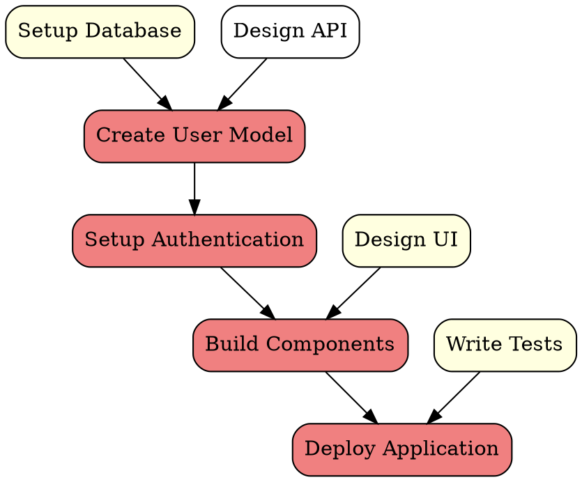
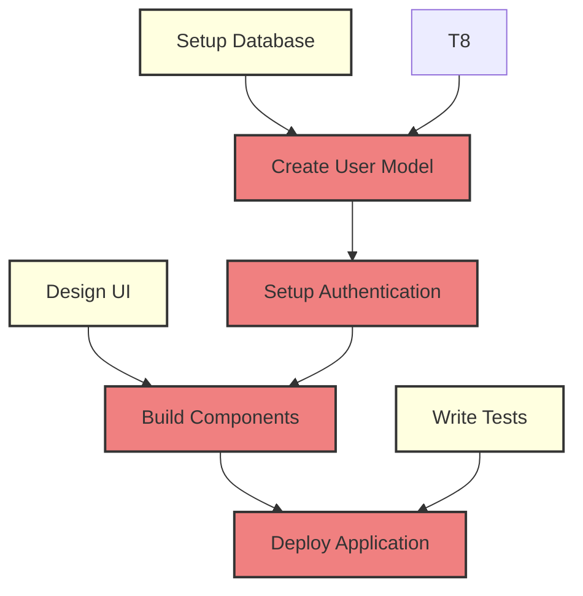
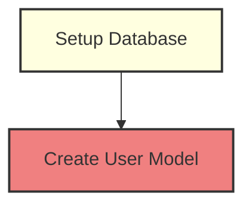

# DAG Visualization Guide

## Overview

The MCP Task Manager now supports **Directed Acyclic Graph (DAG) visualization** for task dependencies, providing visual representations of complex project structures. This feature is integrated into the `analyze_task_dependencies` tool and supports multiple output formats for different use cases.

**Key Benefits:**
- **Visual Understanding**: See task relationships at a glance
- **Bottleneck Identification**: Quickly spot tasks that block multiple others
- **Critical Path Analysis**: Visualize the longest chain of dependent tasks
- **Multi-Agent Coordination**: Help orchestration agents assign work optimally
- **Multiple Formats**: Choose the best visualization for your needs

## Supported DAG Formats

### 1. ASCII Format (Human-Readable)

**Best for:** AI agents, terminal output, quick analysis

The ASCII format provides a human-readable text representation that groups tasks by status and shows dependency relationships clearly.

**Example Output:**
```
Task Dependency Graph (DAG):

🟢 READY TO START:
  • Setup Database → [Create User Model, Setup Authentication]
  • Design UI → [Build Components]
  • Write Documentation → [Review Documentation]

🔴 BLOCKED TASKS:
  • Create User Model ← blocked by [Setup Database, Design API]
  • Setup Authentication ← blocked by [Create User Model]
  • Build Components ← blocked by [Design UI, Setup Authentication]

✅ COMPLETED:
  • Project Planning
  • Requirements Gathering

DEPENDENCY RELATIONSHIPS:
  Create User Model ← depends on: [Setup Database, Design API]
  Setup Authentication ← depends on: [Create User Model]
  Build Components ← depends on: [Design UI, Setup Authentication]
  Deploy Application ← depends on: [Build Components, Write Tests]
```

**Features:**
- **Status Icons**: 🟢 Ready, 🔴 Blocked, ✅ Completed
- **Dependency Arrows**: `→` shows what tasks will be unblocked, `←` shows blocking dependencies
- **Grouped Display**: Tasks organized by current status
- **Relationship Summary**: Complete dependency mapping at the bottom

### 2. DOT Format (Graphviz Compatible)

**Best for:** External visualization tools, documentation, complex graphs

The DOT format is compatible with Graphviz and other graph visualization tools, allowing for sophisticated visual rendering.

**Example Output:**


**Features:**
- **Color Coding**: Different colors for task statuses
- **Priority Styling**: High-priority tasks get thicker borders
- **Hierarchical Layout**: Top-to-bottom dependency flow
- **Professional Rendering**: Can be rendered with Graphviz tools

**Rendering with Graphviz:**
```bash
# Save DOT output to file
echo "digraph TaskDAG { ... }" > tasks.dot

# Render as PNG
dot -Tpng tasks.dot -o tasks.png

# Render as SVG
dot -Tsvg tasks.dot -o tasks.svg
```

### 3. Mermaid Format (Diagram-as-Code)

**Best for:** Documentation, GitHub/GitLab, web-based visualization

Mermaid format is perfect for embedding in documentation and is supported by many platforms including GitHub, GitLab, and documentation tools.

**Example Output:**


**Features:**
- **Clean Node IDs**: Simplified identifiers for readability
- **Status Classes**: CSS-like styling for different task statuses
- **Web-Friendly**: Renders beautifully in browsers and documentation
- **Interactive**: Can be made interactive in supported environments

## Usage Examples

### Basic DAG Visualization

Get an ASCII representation of task dependencies:

```json
{
  "name": "analyze_task_dependencies",
  "arguments": {
    "listId": "123e4567-e89b-12d3-a456-426614174000",
    "format": "dag",
    "dagStyle": "ascii"
  }
}
```

### Generate Graphviz DOT File

Create DOT format for external rendering:

```json
{
  "name": "analyze_task_dependencies",
  "arguments": {
    "listId": "123e4567-e89b-12d3-a456-426614174000",
    "format": "dag",
    "dagStyle": "dot"
  }
}
```

### Documentation-Ready Mermaid

Generate Mermaid format for documentation:

```json
{
  "name": "analyze_task_dependencies",
  "arguments": {
    "listId": "123e4567-e89b-12d3-a456-426614174000",
    "format": "dag",
    "dagStyle": "mermaid"
  }
}
```

### Combined Analysis and Visualization

Get both dependency analysis and DAG visualization:

```json
{
  "name": "analyze_task_dependencies",
  "arguments": {
    "listId": "123e4567-e89b-12d3-a456-426614174000",
    "format": "both",
    "dagStyle": "ascii"
  }
}
```

## Multi-Agent Orchestration Use Cases

### 1. Work Assignment Visualization

**Scenario:** An orchestration agent needs to assign tasks to specialized agents.

```json
{
  "name": "analyze_task_dependencies",
  "arguments": {
    "listId": "web-app-project",
    "format": "dag",
    "dagStyle": "ascii"
  }
}
```

**Output helps identify:**
- Which tasks are ready for immediate assignment
- Which agents can work in parallel
- What the critical path looks like
- Where bottlenecks might occur

### 2. Progress Visualization

**Scenario:** Track progress across multiple agents working on different parts of a project.

```json
{
  "name": "analyze_task_dependencies",
  "arguments": {
    "listId": "web-app-project",
    "format": "both",
    "dagStyle": "mermaid"
  }
}
```

**Benefits:**
- Visual progress tracking
- Clear identification of completed vs. remaining work
- Easy sharing with stakeholders
- Documentation-ready format

### 3. Bottleneck Analysis

**Scenario:** Identify and resolve project bottlenecks.

```json
{
  "name": "analyze_task_dependencies",
  "arguments": {
    "listId": "web-app-project",
    "format": "both",
    "dagStyle": "dot"
  }
}
```

**Helps with:**
- Spotting tasks that block many others
- Identifying critical path tasks
- Planning resource allocation
- Optimizing workflow

## Integration with External Tools

### Graphviz Integration

```bash
# Install Graphviz
brew install graphviz  # macOS
sudo apt-get install graphviz  # Ubuntu
choco install graphviz  # Windows

# Generate and render
curl -X POST "your-mcp-endpoint" \
  -d '{"name": "analyze_task_dependencies", "arguments": {"listId": "...", "format": "dag", "dagStyle": "dot"}}' \
  | jq -r '.content[0].text' > project.dot

dot -Tpng project.dot -o project.png
```

### Mermaid Integration

**In GitHub/GitLab Markdown:**
```markdown
## Project Dependencies


```

**In Documentation Tools:**
Most modern documentation tools (GitBook, Notion, etc.) support Mermaid diagrams natively.

## Best Practices

### Choosing the Right Format

- **ASCII**: For AI agents, terminal output, quick analysis
- **DOT**: For complex graphs, professional presentations, print materials
- **Mermaid**: For documentation, web display, collaborative tools

### Performance Considerations

- **Large Projects**: Use filters to focus on specific parts of the dependency graph
- **Frequent Updates**: Cache DAG visualizations when possible
- **Real-time Display**: ASCII format has the fastest generation time

### Visualization Tips

1. **Keep It Simple**: For complex projects, consider filtering by priority or status
2. **Use Colors Effectively**: Status-based coloring helps identify actionable items
3. **Document Dependencies**: Include DAG visualizations in project documentation
4. **Regular Updates**: Regenerate visualizations as project structure changes

## Troubleshooting

### Common Issues

**Empty DAG Output:**
- Check that tasks have dependencies set
- Verify the list ID is correct
- Ensure tasks exist in the specified list

**Circular Dependencies:**
- The tool will detect and report circular dependencies
- Use the analysis output to identify and break cycles
- Consider restructuring task relationships

**Large Graph Performance:**
- Use the `limit` parameter in `get_ready_tasks` for focused views
- Filter tasks by status or priority before visualization
- Consider breaking large projects into smaller lists

### Format-Specific Issues

**DOT Format:**
- Ensure task titles don't contain special characters that break DOT syntax
- Use quotes around node names with spaces
- Validate DOT syntax with online validators

**Mermaid Format:**
- Keep node IDs simple (T1, T2, etc.)
- Avoid special characters in task titles
- Test rendering in Mermaid live editor

**ASCII Format:**
- Works best with reasonable task title lengths
- May wrap on narrow terminals
- Consider shorter task titles for better display

## Future Enhancements

### Planned Features

- **Interactive DAG**: Clickable nodes for task details
- **Timeline View**: Gantt chart-style dependency visualization
- **Resource Allocation**: Show agent assignments in DAG
- **Progress Animation**: Animated progress through dependency chains
- **Custom Styling**: User-defined colors and styles for different task types

### Integration Roadmap

- **VS Code Extension**: Direct DAG visualization in IDE
- **Web Dashboard**: Browser-based project visualization
- **Mobile Support**: Responsive DAG viewing on mobile devices
- **Export Options**: PDF, PNG, SVG export capabilities

---

The DAG visualization feature transforms complex task relationships into clear, actionable visual representations, making it easier for both AI agents and humans to understand and optimize project workflows.